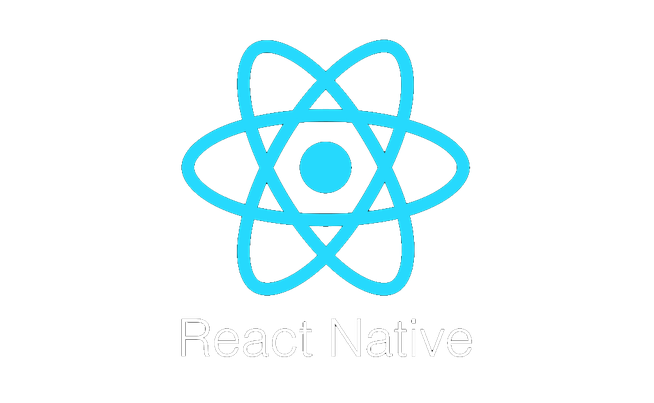
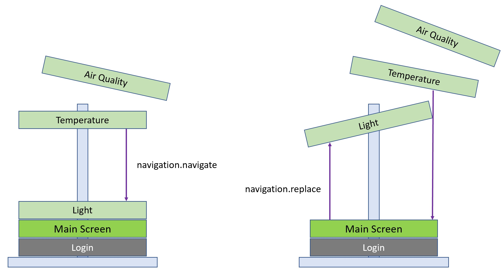
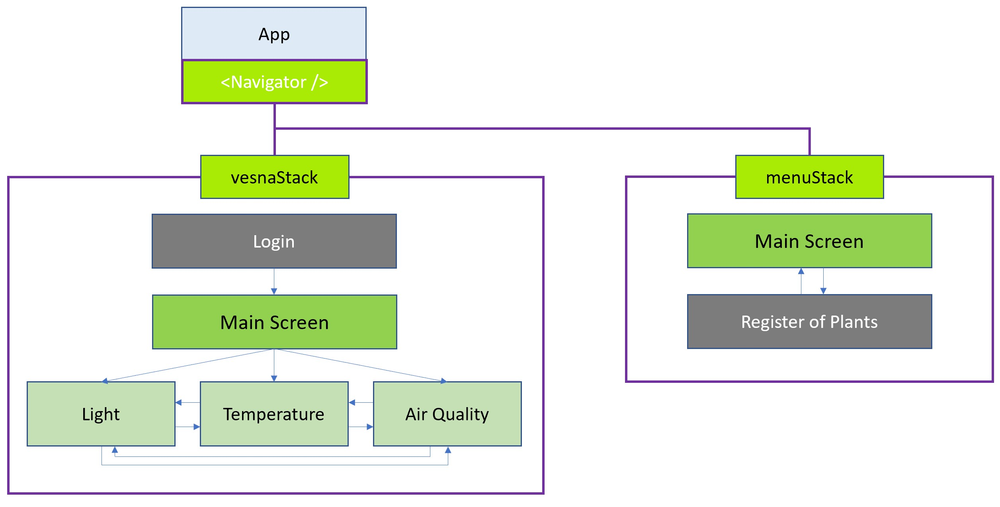
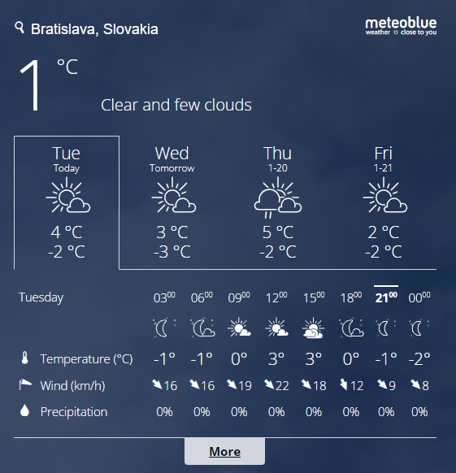

<!-- React Installation -->

  
  <h2>Installation Guide</h2>

How to Install [NodeJS](https://nodejs.org/en/) and NPM:
<dl>
  <dd>1. Download and run the NodeJS Setup Wizard.</dd>
  <dd>2. Command Line - PowerShell, etc. and run commands <code>node -v</code> and <code>npm -v</code> to check the installed versions.
</dl>
 

How to Start - Step-by-Step [Tutorial](https://docs.expo.dev/index.html):
<dl>
  <dd>1. Command Line - PowerShell, etc. Command line tool <code>$ npm install --global expo-cli</code> to install the Expo framework.</dd>
  <dd>2. Pull the full VESNA application from GitHub by <code>$ git pull</code>.</dd>
  <dd>3. Open terminal in the same folder and use <code>$ code .</code> to review the code in VisualStudioCode and <code>$ expo start</code> for the ExpoMetroBundler initialization (<code>http://localhost:19002</code>).</dd>
  <dd>4. Switch the MetroBundler connection to <code>Tunnel</code> and open <code>Expo Go</code> on your mobile phone.</dd>
  <dd>5. Scan the newly generated QR code.</dd>
  <dd>6. Done, the application should be running.</dd>
</dl>

<!-- PROJECT LOGO -->
 

  
  <h3 align="center">Versatile Simulator for Near-zero Emissions Agriculture</h3>
  
Next-generation of Smart Eco Greenhouse developed by open-minded young researchers and students.
 

  <h2>Documentation for App Team</h2>

<h4>1. An application for mobile devices connected to a suitable cloud service</h4>
  <dl>
    <dt>The body of the application</dt>
    <dd>  In a web browser, you can link to different pages using an anchor <code><`a`></code>tag. When the user clicks on a link, the URL is pushed to the browser history stack. When the user presses the back button, the browser pops the item from the top of the history stack, so the active page is now the previously visited page. React Native doesn't have a built-in idea of a global history stack like a web browser does - this is where React Navigation enters the story.</dd> 
  </dl>
 

<dl>
    
  
 
  
  <dd>React Navigation's native stack navigator provides a way for your app to transition between screens and manage navigation history. If your app uses only one stack navigator then it is conceptually similar to how a web browser handles navigation state - your app pushes and pops items from the navigation stack as users interact with it, and this results in the user seeing different screens. A key difference between how this works in a web browser and in React Navigation is that React Navigation's native stack navigator provides the gestures and animations that you would expect on Android and iOS when navigating between routes in the stack.</dd> 
  </dl>

   

    
  
 
  <dl>
  <dd><code>createNativeStackNavigator</code> is a function that returns an object containing 2 properties: <code>Screen</code> and <code>Navigator</code>. Both of them are React components used for configuring the navigator. The <code>Navigator</code> should contain <code>Screen</code> elements as its children to define the configuration for <code>routes</code>. <code>NavigationContainer</code> is a component which manages our navigation tree. This component must wrap all navigators structure. We render this component at the root of our app, which is the component exported from <code>App.js</code>.</dd> 
  
          import Navigator from './route/mainMenu';
          import React from 'react';

          function App() {

            return (
              <Navigator/>
            )
          }
          export default App;
  
  <h4>The structure of the Application consists of these main parts:</h4>
  <dl><dd>The core of the application consists of the <code><`Navigator`/></code>. VESNA app consists of two stacks >> main - <code>HomeStack</code> which includes all the sensors and actuators, and secondary side-panel navigation <code>MainStack</code> that mainly includes the secondary tasks such as register of plants.</dd></dl>
  
  const mainMenu = createDrawerNavigator({
    VESNA: {
        screen: HomeStack,
    },
    Plants: {
        screen: MainStack,
    }
}
  
  Part - 1: <code>Imports</code> consist of all the libraries used in the application itself. To install a library in the project, navigate to the directory and open a terminal. Then run the installation command. <code> npm install library-name-example</code>.
  
        import { createStackNavigator } from 'react-navigation-stack';
        import Home from '../screens/Home';
        import Temperature from '../screens/Temperature';
        import Light from '../screens/Light';
        import AirQuality from '../screens/AirQuality';
        import Login from '../screens/Login';
        import Header from '../shared/header';
        import React from 'react';
  
  Part - 2: <code>Screens</code> are defined as a <code>const</code>. All the imports are added and create a register of screens to navigate in-between. Then, they are implemented into the <code>NavigationStack</code>.
  
        const screens = {
          Home: {
            screen: Home,
            navigationOptions: ({ navigation }) => {
              return {
                headerLeft: () => <Header navigation={navigation} title='VESNA' />,
                headerTitle: () => null,
              }
            }
          },
        }
  
  Part - 3: All screens added into the <code>Stack</code> are implemented into the configuration and create routes between individual screens.
  
          export default NavigationStack;
  
  Part - 4: <code>Styles</code> are defined at the end of the script to be separated and easily modified.
  
          const styles = StyleSheet.create({

          main_text: {
            textAlign: "center",
            fontFamily: "Cochin",
            fontWeight: "bold",
            color: '#3A6238',
            fontSize: 30,
            lineHeight: 40,
          }
  
  <dt>Cloud connection - data import/export to/from the microcontroller via WiFi</dt>
  <dd>ThingSpeak™ is platform that allowed us to work with data streams in the cloud. It provides an instant visualization of data posted by VESNA sensors to ThingSpeak servers. As it is paired with the MATLAB® code environment, we can perform online analysis and processing of the data as it comes in, and display them in the application</dd>
  <dd>For the cloud connection to the thingspeak server a communication was created. Multiple sources of documentation were used, such as [thingspeakRead](https://www.mathworks.com/help/thingspeak/thingspeakread.html) or [dataRead](https://www.mathworks.com/help/thingspeak/readdata.html) and other research. After successful connection, we could display all data using a <code>.json</code> format data file.</dd>
  </dl> 
  
        const [data, setData] = useState([]);
        useEffect(() => {
          // (1) define within effect callback scope
          const fetchData = async () => {
            try {
              const res = await fetch('https://thingspeak.com/channels/1548631/fields/2.json?results=1');
              const json = await res.json();
              setData(json);
            } catch (error) {
              console.log(error);
            }
          };

          const id = setInterval(() => {
            fetchData(); // <-- (3) invoke in interval callback
          }, 6000);

          fetchData(); // <-- (2) invoke on mount

          return () => clearInterval(id);
        }, [])
  

Manual Control from the Application:
[ThingSpeakChannel](https://thingspeak.com/channels/1634565)

Data from Core Team:
[ThingSpeakChannel1](https://thingspeak.com/channels/1632859), 
[ThingSpeakChannel2](https://thingspeak.com/channels/1635834)

**<h4>4. Current value indication from each sensor</h4>**
<dl>
<dd>The <code>WebView</code> component requires a source prop. This prop loads the static HTML or a URI. A URI is a remote location for a web page to exist. A static HTML will be some internal HTML file that embeds some content to display. Similarly all other graphs from the <code>ThingSpeak</code> website, that is <cúde>Evolution graphs of sensor values</code> and <code>Evolution graphs of status for actuators</code> were implemented using this method.</dd></dl> 

            <WebView 
              source={{ 
              uri: 'https://thingspeak.com/channels/1633394/charts/3?bgcolor=%23ffffff&color=%23d62020&dynamic=true&results=60&type=step'
              }} 
              scalesPageToFit={true}
              style={{ width: '220%', marginTop: 2,marginBottom: 5}}
            />

**<h4>5. Current status indication for all actuators (ON/OFF)</h4>**
<dl><dd>Switches are the preferred way to adjust settings on mobile. The option that the switch controls, as well as the state it's in, should be made clear from the corresponding inline label. It is a controlled component that renders a boolean input and requires an update in order for the component to reflect user actions. If the value prop is not updated, the component will continue to render the supplied value prop. In other words, they toggle the state of a single setting on or off. </dd></dl>

            // Switch for on/off manual control
            const [isEnabled, setIsEnabled] = useState(false);
            const toggleSwitch = () => setIsEnabled(previousState => !previousState);
            
                try {
                  fetch('https://api.thingspeak.com/update.json' , {
                   method: 'POST',
                   headers: {
                     Accept: 'application/json',
                     'Content-Type': 'application/json',
                   },
                   body: JSON.stringify(
                     {
                       "api_key": "87FQ51LBR379FTF3",
                       "field3":  isEnabled ? '1' : '0',
                     }
                   )
                 });
            
**<h4>6. Implementation of manual (ON/OFF) control for each actuator</h4>**
<dl><dd>Similar approach was used in this section.</dd></dl>

            // Switch for on/off actuator
            const [isEnabled1, setIsEnabled1] = useState(false);
            const toggleSwitch1 = () => {
              setIsEnabled1(previousState => !previousState)}  
              
                  try {
                    fetch('https://api.thingspeak.com/update.json' , {
                     method: 'POST',
                     headers: {
                       Accept: 'application/json',
                       'Content-Type': 'application/json',
                     },
                     body: JSON.stringify(
                       {
                         "api_key": "87FQ51LBR379FTF3",
                        //  Livka channel F8RX7M2SU9EY8R44
                         "field4": isEnabled1 ? '1' : '0',
                       }
                     )
                   });

**<h4>7. Weather forecast integration</h4>**
<dl><dd>The current weather forecast for Bratislava, where the VESNA smart greenhouse is located, is displayed in a form of an interactive <code>Widget</code> on a separate screen in the <code>StackNavigator</code>. We used the current web-forecast from [meteoblue](https://www.meteoblue.com/en/weather/widget/setupmap/bratislava_slovakia_3060972)</dd></dl>

  

**<h4>8. Selection of plants including a set of SP values for various controlled variables</h4>**
<dl><dd>A blank screen was created in the <code>StackNavigator</code> for future work.</dd></dl>
  Suggestion: use different, custom [method](https://grafana.com) to show each graph.

**<h4>9. User-Login authentication to assign the access rights</h4>**
<dl><dd>A model example of a login screen was created for future work.</dd></dl>

---
  Potentional Future Work:

How to [deploy](https://blog.logrocket.com/how-to-deploy-a-react-native-app-to-the-google-play-store/) a React Native app to the Google Play Store:
<dl>
  <dd>1. Digitally signing your Android app.</dd>
  <dd>2. Generating an upload key.</dd>
  <dd>3. Updating Gradle files.</dd>
  <dd>4. Generating the APK release build.</dd>
  <dd>5. Testing the release build.</dd>
</dl>
